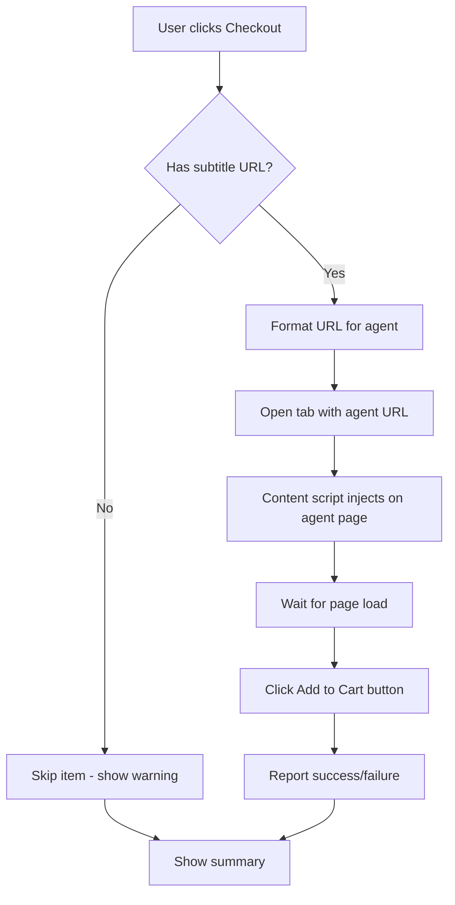

# YuCart Checkout Feature - Implementation Plan

## Overview

Add a checkout feature that allows users to add all cart items to their selected shopping agent (Superbuy, Sugargoo, KakoBuy, or Raw). The feature will:

1. Extract Weidian/Taobao URLs from the `subtitle` field of cart items
2. Format URLs for the selected agent
3. Open all product pages in new tabs
4. Automatically click "Add to Cart" on each agent page
5. Display a loading splash screen during the process

## Architecture



## URL Formatting Patterns

### Agent URL Templates

| Agent | URL Pattern |
|-------|-------------|
| **Superbuy** | `https://www.superbuy.com/en/page/buy/?nTag=Home-search&from=search-input&url=<ENCODED_URL>` |
| **Sugargoo** | `https://www.sugargoo.com/products?productLink=<DOUBLE_ENCODED_URL>` |
| **KakoBuy** | `https://www.kakobuy.com/item/details?url=<ENCODED_URL>` |
| **Raw** | Original URL unchanged |

### Encoding Notes
- **Superbuy**: Single URL encoding (`encodeURIComponent`)
- **Sugargoo**: Double URL encoding (`encodeURIComponent(encodeURIComponent(url))`)
- **KakoBuy**: Single URL encoding
- **Raw**: No encoding

### Example Transformation

**Original Weidian URL:**
```
https://weidian.com/item.html?itemID=7657450394
```

**Superbuy Formatted:**
```
https://www.superbuy.com/en/page/buy/?nTag=Home-search&from=search-input&url=https%3A%2F%2Fweidian.com%2Fitem.html%3FitemID%3D7657450394
```

## Implementation Details

### 1. Manifest Updates

Add host permissions for agent domains:

```json
{
  "host_permissions": [
    "https://www.superbuy.com/*",
    "https://www.sugargoo.com/*",
    "https://www.kakobuy.com/*",
    "https://weidian.com/*",
    "https://*.taobao.com/*",
    "https://*.tmall.com/*"
  ]
}
```

Add content scripts for agent pages:

```json
{
  "content_scripts": [
    {
      "matches": [
        "https://www.superbuy.com/*",
        "https://www.sugargoo.com/*",
        "https://www.kakobuy.com/*"
      ],
      "js": ["content/agent-content.js"],
      "run_at": "document_idle"
    }
  ]
}
```

### 2. UI Components

#### Popup Footer - Agent Selector and Checkout Button

```html
<footer class="footer" id="footer">
    <div class="agent-selector">
        <label for="agentSelect">Agent:</label>
        <select id="agentSelect">
            <option value="superbuy">Superbuy</option>
            <option value="sugargoo">Sugargoo</option>
            <option value="kakobuy">KakoBuy</option>
            <option value="raw">Raw - Original URL</option>
        </select>
    </div>
    <button class="btn btn--checkout" id="checkoutBtn">
        <svg>...</svg>
        Checkout
    </button>
    <div class="totals">...</div>
</footer>
```

#### Loading Splash Screen

```html
<div class="checkout-overlay" id="checkoutOverlay">
    <div class="checkout-overlay__content">
        <div class="checkout-overlay__spinner"></div>
        <h3>Processing Checkout...</h3>
        <p id="checkoutProgress">Opening 5 of 10 items</p>
        <div class="checkout-overlay__items">
            <!-- List of items being processed -->
        </div>
    </div>
</div>
```

### 3. Settings Storage

Add `selectedAgent` to settings:

```javascript
const DEFAULT_SETTINGS = {
  targetCurrency: 'USD',
  darkMode: true,
  selectedAgent: 'superbuy'  // Default agent
};
```

### 4. Content Script for Agent Pages

Create `content/agent-content.js`:

```javascript
// Auto-click Add to Cart on agent pages
(function() {
    'use strict';
    
    // Button selectors for each agent
    const BUTTON_SELECTORS = {
        superbuy: '.goods-addToCart, button[class*="addToCart"]',
        sugargoo: '.goods-addToCart, button[class*="add-cart"]',
        kakobuy: '.goods-addToCart, button[class*="addToCart"]'
    };
    
    function detectAgent() {
        const host = window.location.hostname;
        if (host.includes('superbuy')) return 'superbuy';
        if (host.includes('sugargoo')) return 'sugargoo';
        if (host.includes('kakobuy')) return 'kakobuy';
        return null;
    }
    
    function clickAddToCart() {
        const agent = detectAgent();
        if (!agent) return;
        
        const selector = BUTTON_SELECTORS[agent];
        const btn = document.querySelector(selector);
        
        if (btn && !btn.disabled) {
            btn.click();
            
            // Notify extension of success
            chrome.runtime.sendMessage({
                action: 'checkoutItemComplete',
                success: true,
                url: window.location.href
            });
        }
    }
    
    // Wait for page to be ready
    if (document.readyState === 'loading') {
        document.addEventListener('DOMContentLoaded', () => {
            setTimeout(clickAddToCart, 1500); // Delay for dynamic content
        });
    } else {
        setTimeout(clickAddToCart, 1500);
    }
})();
```

### 5. Checkout Flow in popup.js

```javascript
async function handleCheckout() {
    const agent = document.getElementById('agentSelect').value;
    const itemsWithUrls = cart.filter(item => item.subtitle && isValidAgentUrl(item.subtitle));
    
    if (itemsWithUrls.length === 0) {
        showToast('No items with valid Weidian/Taobao URLs');
        return;
    }
    
    // Show loading overlay
    showCheckoutOverlay(itemsWithUrls);
    
    for (let i = 0; i < itemsWithUrls.length; i++) {
        const item = itemsWithUrls[i];
        updateCheckoutProgress(i + 1, itemsWithUrls.length, item);
        
        const agentUrl = formatAgentUrl(item.subtitle, agent);
        chrome.tabs.create({ url: agentUrl, active: false });
        
        // Small delay between tabs to avoid overwhelming browser
        await new Promise(resolve => setTimeout(resolve, 500));
    }
    
    // Hide overlay after all tabs opened
    setTimeout(() => {
        hideCheckoutOverlay();
        showToast(`Opened ${itemsWithUrls.length} items in ${agent}`);
    }, itemsWithUrls.length * 500 + 1000);
}

function formatAgentUrl(originalUrl, agent) {
    switch (agent) {
        case 'superbuy':
            return `https://www.superbuy.com/en/page/buy/?nTag=Home-search&from=search-input&url=${encodeURIComponent(originalUrl)}`;
        case 'sugargoo':
            return `https://www.sugargoo.com/products?productLink=${encodeURIComponent(encodeURIComponent(originalUrl))}`;
        case 'kakobuy':
            return `https://www.kakobuy.com/item/details?url=${encodeURIComponent(originalUrl)}`;
        case 'raw':
        default:
            return originalUrl;
    }
}

function isValidAgentUrl(url) {
    if (!url) return false;
    return url.includes('weidian.com') || 
           url.includes('taobao.com') || 
           url.includes('tmall.com');
}
```

### 6. CSS Additions

Add styles for the checkout overlay and agent selector:

```css
/* Agent Selector */
.agent-selector {
    display: flex;
    align-items: center;
    gap: 8px;
    margin-bottom: 12px;
}

.agent-selector select {
    flex: 1;
    padding: 8px 12px;
    border-radius: 6px;
    border: 1px solid var(--border-color);
    background: var(--bg-secondary);
    color: var(--text-primary);
}

/* Checkout Button */
.btn--checkout {
    width: 100%;
    padding: 12px;
    background: linear-gradient(135deg, #667eea 0%, #764ba2 100%);
    color: white;
    border: none;
    border-radius: 8px;
    font-weight: 600;
    cursor: pointer;
    transition: transform 0.2s, box-shadow 0.2s;
}

.btn--checkout:hover {
    transform: translateY(-1px);
    box-shadow: 0 4px 12px rgba(102, 126, 234, 0.4);
}

/* Checkout Overlay */
.checkout-overlay {
    position: fixed;
    inset: 0;
    background: rgba(0, 0, 0, 0.8);
    display: flex;
    align-items: center;
    justify-content: center;
    z-index: 9999;
    opacity: 0;
    visibility: hidden;
    transition: opacity 0.3s, visibility 0.3s;
}

.checkout-overlay--active {
    opacity: 1;
    visibility: visible;
}

.checkout-overlay__content {
    background: var(--bg-primary);
    padding: 32px;
    border-radius: 16px;
    text-align: center;
    max-width: 400px;
    width: 90%;
}

.checkout-overlay__spinner {
    width: 48px;
    height: 48px;
    border: 4px solid var(--border-color);
    border-top-color: #667eea;
    border-radius: 50%;
    animation: spin 1s linear infinite;
    margin: 0 auto 16px;
}

@keyframes spin {
    to { transform: rotate(360deg); }
}
```

## File Changes Summary

| File | Changes |
|------|---------|
| [`manifest.json`](manifest.json) | Add host permissions, add content script for agent pages |
| [`popup/popup.html`](popup/popup.html) | Add agent selector, checkout button, loading overlay |
| [`popup/popup.css`](popup/popup.css) | Add styles for new UI components |
| [`popup/popup.js`](popup/popup.js) | Add checkout logic, URL formatting, overlay handling |
| [`options/options.html`](options/options.html) | Add agent preference dropdown |
| [`options/options.js`](options/options.js) | Save/load agent preference |
| [`background/service-worker.js`](background/service-worker.js) | Add `selectedAgent` to default settings |
| `content/agent-content.js` | **NEW** - Content script for auto-clicking Add to Cart |

## Edge Cases to Handle

1. **Items without subtitle URLs**: Show warning, skip in checkout
2. **Invalid URL types**: Only process Weidian/Taobao/Tmall links
3. **Agent page load failures**: Content script should timeout and report failure
4. **Button not found**: Try multiple selectors, report failure if not found
5. **Rate limiting**: Add delay between tab opens to avoid browser throttling

## Testing Checklist

- [ ] Verify URL encoding for each agent
- [ ] Test checkout with items missing subtitle URLs
- [ ] Test checkout with mixed valid/invalid URLs
- [ ] Verify Add to Cart button is clicked on each agent
- [ ] Test loading overlay shows correct progress
- [ ] Verify agent preference is saved/loaded correctly
- [ ] Test on both Weidian and Taobao URLs
