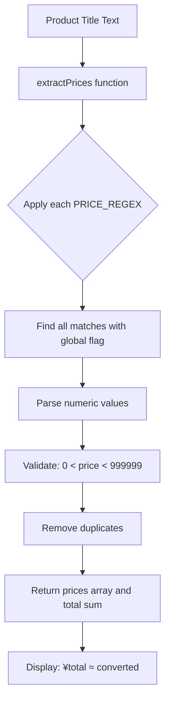

# Price Conversion Improvement Plan

## Overview

Improve price extraction to handle multiple prices in product titles (e.g., `¥129+¥155`) by extracting all prices and displaying the sum with converted total.

## Current Behavior

The current [`extractPrice()`](content/content.js:67) function in `content.js` only extracts the **first** price found in text:

```javascript
function extractPrice(text) {
    for (const re of PRICE_REGEX) {
        const m = text.match(re);
        if (m) {
            const p = parseFloat(m[1].replace(/,/g, ''));
            if (p > 0 && p < 999999) return p;
        }
    }
    return null;
}
```

**Problem**: For a title like `¥129+¥155 Football Set`, only `¥129` is extracted, missing the additional `¥155`.

## Proposed Solution

### 1. New `extractPrices()` Function

Create a new function that extracts **all** prices from text and returns their sum:

```javascript
function extractPrices(text) {
    const prices = [];
    
    for (const re of PRICE_REGEX) {
        // Use global flag to find all matches
        const globalRe = new RegExp(re.source, 'g');
        let match;
        while ((match = globalRe.exec(text)) !== null) {
            const p = parseFloat(match[1].replace(/,/g, ''));
            if (p > 0 && p < 999999) {
                prices.push(p);
            }
        }
    }
    
    // Remove duplicates (same price found by different regex patterns)
    const uniquePrices = [...new Set(prices)];
    
    return {
        prices: uniquePrices,
        total: uniquePrices.reduce((sum, p) => sum + p, 0)
    };
}
```

### 2. Price Separator Patterns to Handle

The function should naturally handle prices separated by:

| Separator | Example | Notes |
|-----------|---------|-------|
| `+` | `¥129+¥155` | Most common |
| Space | `¥129 ¥155` | Multiple spaces |
| Comma | `¥129,¥155` | English comma |
| Chinese comma | `¥129，¥155` | Full-width comma |
| Chinese enumeration | `¥129、¥155` | Chinese顿号 |

Since we're using regex to find all price patterns, these separators are handled automatically - we just extract all valid prices regardless of what separates them.

### 3. Updated Price Display

**Before**: `¥129 ≈ A$26.20`

**After**: `¥284 ≈ A$57.60` (sum of ¥129+¥155)

### 4. Files to Modify

#### [`content/content.js`](content/content.js)

1. **Replace `extractPrice()` with `extractPrices()`** (line 67-76)
   - Returns object with `prices` array and `total` sum
   - Handles all price patterns globally

2. **Update callers of `extractPrice()`**:
   - [`processAlbumListings()`](content/content.js:436) - line 436
   - [`processDetailPage()`](content/content.js:489) - line 489
   - [`processIndexPage()`](content/content.js:552) - line 552
   - All should use `extractPrices(text).total`

3. **Update price display format**:
   - [`createCartButton()`](content/content.js:296-297) - line 296-297
   - Price badges in overlay - lines 462-463, 576-577
   - Detail bar display - line 519-520

#### [`popup/popup.js`](popup/popup.js)

- No changes needed - popup displays the stored price which will already be the sum

### 5. Edge Cases to Consider

| Case | Input | Expected Output |
|------|-------|-----------------|
| Single price | `¥129 Football` | `¥129` |
| Two prices with + | `¥129+¥155 Set` | `¥284` |
| Multiple spaces | `¥129 ¥155 ¥200` | `¥484` |
| Chinese separators | `¥129，¥155、¥200` | `¥484` |
| Mixed formats | `129Y+¥155` | `¥284` |
| Price in description | `¥129 (was ¥200)` | `¥329` - may need refinement |
| Duplicate detection | `¥129+¥129` | `¥129` (unique only) |

### 6. Potential Enhancement: Smart Price Detection

Consider whether to sum ALL prices or be smarter about context:

- **Sum all**: Simple, works for bundles like `¥129+¥155`
- **Smart detection**: Could detect context like "was ¥200" and exclude it

**Recommendation**: Start with "sum all unique prices" approach for simplicity. Can add smart detection later if needed.

## Implementation Steps

1. Create new `extractPrices()` function in `content/content.js`
2. Update all call sites to use `.total` from the returned object
3. Test with various price formats
4. Verify cart and popup display correctly

## Testing Scenarios

```
Input: "¥129 ≈ A$26.20（¥129+¥155）Football Set"
Expected: Total price ¥284, Display: ¥284 ≈ A$57.60

Input: "199Y Football Jersey"  
Expected: Total price ¥199

Input: "¥129 + ¥155 + ¥200 Bundle"
Expected: Total price ¥484
```

## Diagram: Price Extraction Flow



## Questions Resolved

- ✅ Multiple prices should be **summed** and show total
- ✅ Various separators should be handled: +, spaces, commas, Chinese characters
- ✅ Display format: `¥284 ≈ A$57.60` (total with conversion)
